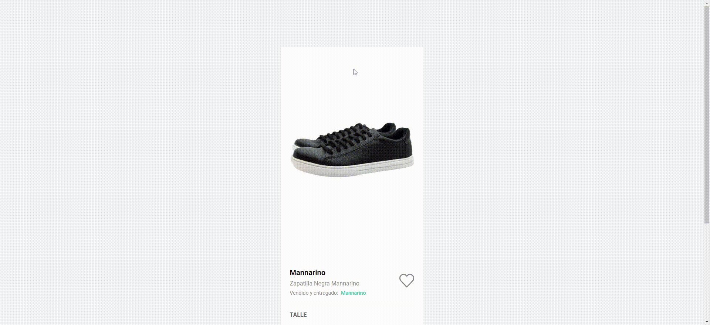

# Examen técnico - Oscar Arenas

Examen tecnico.



## Primeros pasos

Primero, ejecute el servidor de desarrollo:

```bash
npm run dev
# ó
yarn dev
```

Abrir [http://localhost:3000](http://localhost:3000) en el navegador para visualizar el elemento `<ProductCard />`. Es todo!

## Info

Este desarrollo cuenta con lo siguiente:

- NextJs
- Tailwind css
- Elemento apto para generar resultados enriquecidos. [Ver resultado.](https://search.google.com/test/rich-results?utm_campaign=sdtt&utm_medium=code&id=dT2SSaoRm7NgXB9yxPk34w)
